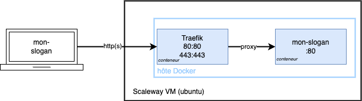

# TP#5: Déploiement continu

**Objectifs** : Mettre en place du déploiement continu avec Github Action sur une application toute simple.
 
## Mise en place de votre pipeline de déploiement continu

### Étape 1: Créez votre répertoire Github

- Via votre compte github, créez un nouveau *repository* (répertoire) en privé
  - vous pouvez l'appeler `deploiement-continu`
- Clonez votre projet sur votre poste de travail
- Ajoutez le fichier `index.html` du [TP#1](https://github.com/ffauchille/2023-hetic-tp-1?tab=readme-ov-file#%C3%A9tape-2---d%C3%A9ployez-votre-application-minimale) du cours précédent
- Pushez votre fichier et assurez-vous qu'il apparaît bien sur Github

### Étape 2: Créez l'image docker pour votre application toute simple

Depuis votre répertoire clonez sur votre poste de travail:
- Créez un fichier `Dockerfile` à la racine du répertoire
  - Comme image de base, utilisez [nginx:1.22.1](https://hub.docker.com/_/nginx)
  - Copiez le fichier `index.html` dans le conteneur à l'emplacement `/usr/share/nginx/html/index.html` (ceci remplace le fichier par défaut d'`nginx`)

```dockerfile
FROM nginx:1.22.1
COPY index.html /usr/share/nginx/html/index.html
```

- Buildez et tester votre image sur votre poste de travail:
  - `docker image build -t mon-slogan .`
  - `docker container run -p 8080:80 mon-slogan`
- Vous devriez accéder à votre page HTML à l'adresse: http://localhost:8080 

Si c'est le cas, pushez vos changements sur `main`.

### Étape 3: Déployez votre image sur votre serveur distant

#### Assurez vos l'accès à votre serveur distant

- Récupérez la clé SSH donné par votre professeur
- Assurez-vous que vous pouvez vous connecter (`etudiantXX` à remplacer par votre identifiant d'étudiant):

```sh
ssh -i <chemin_clee_privee> ubuntu@etudiantXX.floless.fr
```

Docker est déjà installé sur votre VM.
En plus de Docker, un conteneur de Traefik est lancé et correctement configuré.

Voici un schéma de l'infrastrucutre de votre production:



#### Transférer l'image docker de votre poste de travail vers le serveur distant

**Problématique** :
- Vous buildez votre image docker sur votre poste de travail
- Vous devez lancer le conteneur docker sur votre serveur distant (VM chez Scaleway)

Il vous faut une application tierc qui vous permet de recevoir et d'envoyer vos images docker.

Pour cela, vous allez utiliser la [docker container registry fournise par Github](https://docs.github.com/en/packages/working-with-a-github-packages-registry/working-with-the-container-registry)

#### Push your docker image using Github's container registry

**Objectif** : depuis votre poste de travail:

- `push` l'image docker buildée depuis votre poste de travail
- `run` votre image docker depuis votre serveur distant

##### Créez votre *private access token* (PAT)

Afin d'utiliser la *Github container registry*, vous devez créer un Token d'accès qui jouera le role d'authentification.

Vous allez créer un *Github private access token (PAT)* avec les accès *read/write* sur la *registry*:
- Depuis votre compte sur Github:
  - allez sur `profile` > `settings` > `developer settings`
  - `Personal access tokens` > `Tokens(classic)` > `Generate new token (classic)`:
    - Note: mon-slogan
    - Expiration: `No expiration`
    - Selected scopes:
      - `repo` (all)
      - `write:packages`

**Gardez le token sur votre poste de travail. Vous ne le reverrez pas.**

Sauver votre *PAT* dans un fichier **en dehors** de votre projet github. C'est une donnée sensible, si quelqu'un obtien ce token, il peut se faire passer pour vous et accéder votre registry docker à votre place.

##### Pushez votre image sur la *Github container registry*

Depuis votre poste de travail, vous devez d'abord vous authentifier avec votre *PAT* à la *Github container registry*

```sh
cat <chemin_vers_votre_PAT> | docker login ghcr.io -u VOTRE_ID_GITHUB --password-stdin
```

Vous devez voir `Login Succeeded` en sortie de la commande.

Vous pouvez désormais pusher des images docker dans la *Github container registry*. Ces images ne sont accessibles uniquement par vous via votre *PAT*.
Pour push une image docker, vous devez respecter un certain format de `tag`.

Le format à respecter est le suivant:

```sh
# si vous n'êtes PAS sur un Mac avec puce Apple M1 ou M2
docker image build -t NOM_REGISTRY/VOTRE_ID_GITHUB/NOM_REPERTOIRE/NOM_IMAGE:TAG_IMAGE .
# sinon 
docker buildx build --platform linux/amd64 -t NOM_REGISTRY/VOTRE_ID_GITHUB/NOM_REPERTOIRE/NOM_IMAGE:TAG_IMAGE .
```

- Le `nom_de_la_registry` doit être celui de la *Github container registry (ghcr)*: `ghcr.io`
- L'`identifiant_github` doit être remplacé par votre identifiant Github
- Le `nom_du_repertoire` doit être le nom de votre *repository* Github: `deploiement-continu`
- Le `nom_image` peut être `mon-slogan`, le nom choisi pour cette simple page HTML
- Le `tag_image` peut être `v1` vu que c'est la première version de notre application

Une fois build, vous pouvez pousser l'application (en remplaçant comme dans la commande du dessus):

```sh
docker image push NOM_REGISTRY/VOTRE_ID_GITHUB/NOM_REPERTOIRE/NOM_IMAGE:TAG_IMAGE
```

> Note: Vous devez être dans la même session de terminal que celui où vous avez tapé `docker login`.

#### Lancez votre conteneur sur le serveur distant

> **ATTENTION**: Si vous êtes sur un poste de travail MAC avec un processeur non-intel (apple chip), vous ne pouvez pas faire
> cette étape. Dans ce cas, vérifiez uniquement votre accès à votre serveur distant puis passez à l'étape suivante.

Connectez vous en `ssh` à votre serveur distant.

- Envoyez via la commande `scp` votre *PAT* sur votre serveur distant (remplaçant `etudiantXX` par votre identifiant d'étudiant)

```sh
scp -i <chemin_clee_privee> <chemin_PAT> ubuntu@etudiantXX.floless.fr:
```

- Authentifiez vous à votre *Github container registry* depuis votre session `ssh` sur votre serveur distant:

```sh
cat <chemin_vers_votre_PAT> | docker login ghcr.io -u VOTRE_ID_GITHUB --password-stdin
```

- Récupérez votre image docker via la commande `docker pull` (en remplaçant les identifiants comme ci-dessus):

```sh
docker pull NOM_REGISTRY/VOTRE_ID_GITHUB/NOM_REPERTOIRE/NOM_IMAGE:TAG_IMAGE
```

- Voici la liste des labels Traefik que votre conteneur doit spécifier:

```sh
"traefik.http.routers.mon-slogan.rule=Host(\`etudiantXX.floless.fr\`)"  # détermine le nom de domaine vers lequel Traefik va reverse proxy les requêtes
"traefik.http.routers.mon-slogan.tls=true" # Active la connexion SSL (pour activer l'HTTPS)
"traefik.http.routers.mon-slogan.tls.certresolver=letsencrypt"  # définit comment récupérer le certificat SSL
"traefik.enable=true" # autorise Traefik à inspecter ce conteneur
"traefik.docker.network=web" # définit le réseau docker du conteneur (vous pouvez le voir en tapant la commande `docker network ls`)
```

Tapez la commande suivante pour démarrer le conteneur de votre application depuis votre serveur distant (en adaptant `etudiantXX` par votre identifiant):

```sh
  docker container run -d --network web \
    --name mon-slogan \
    --label "traefik.http.routers.mon-slogan.rule=Host(\`mon-slogan.etudiantXX.floless.fr\`)" \
    --label "traefik.http.routers.mon-slogan.tls=true" \
    --label "traefik.http.routers.mon-slogan.tls.certresolver=letsencrypt" \
    --label "traefik.enable=true" \
    --label "traefik.docker.network=web" \
    NOM_REGISTRY/VOTRE_ID_GITHUB/NOM_REPERTOIRE/NOM_IMAGE:TAG_IMAGE
```

> Note 2: il faut échapper \`mon-slogan.etudiantXX.floless.fr\` pour que Treafik interprète cette chaîne de charactère correctement.

Une fois lancée, vous devriez pouvoir accéder à votre application à l'adresse `https://mon-slogan.etudiantXX.floless.fr` (en HTTPS!)

### Étape 4: Automatisez le déploiement

Tout ce que vous avez fait à la main, vous pouvez le scripter pour rendre le déploiement de votre application automatique.

**Objectif** : après chaque **push sur la branche `main`**, je veux que mon application avec cette nouvelle version sur main soit **déployée sur le seveur distant (VM chez Scaleway)**.

En d'autre termes, vous allez implémenter du déploiement continu pour votre application.

Ce que vous avez fait jusqu'à présent:

- `build` votre application en utilisant une image docker
- `publié` votre application en utilisant la *Github container registry (ghcr.io)*
- `deployé` votre application en utilisant `ssh` et la commande `docker container run ...`

#### Étape 4.1: Créez votre premier workflow github

*Github action* est un outil entièrement intégré à Github.

Pour intégrer *Github actions* à votre projet, vous devez créer un nouveau fichier `yml`
sous le dossuer `.github/workflows/` à la racine de votre répertoire Github

C'est votre chance, Github fourni un template pour créer ce fichier sans laisser la place aux erreurs de typographie!

Depuis la page web de votre projet Github:

- Sélectionnez l'onglet `Action` > puis clickez sur `configure` du template `Simple workflow`

- Pushez le fichier en clickant sur le bouton vert `Start commit` sur main, en laissant toutes les valeurs par défaut.
Puis cliquez sur `Commit new file`
- Depuis l'onglet' `Action` de votre projet sur Github, vous devriez voir les logs de votre premier *workflow*

Que s'est-il passé? :

- Vous avez mis en place un *workflow* qui sera exécuté à chaque `git push` sur la branche `main`
- Le *workflow* est un script qui s'exécute quelque part sur un serveur distant de chez Github sur un système linux `ubuntu`
- Vous pouvez [voir tous les choix de système d'exploitation pour exécuter des *workflow* Github](https://docs.github.com/en/actions/using-github-hosted-runners/about-github-hosted-runners#supported-runners-and-hardware-resources)

#### Étape 4.2: Configurez votre workflow

Avant de démarrer, assurez-vous :

- de récupérer les derniers changements sur votre poste de travail (après avoir pusher le premier fichier workflow depuis l'interface de Github):

```sh
git pull origin main
```

- d'avoir compris les étapes précédentes
- d'avoir lu le fichier `deploy.yml` avec le commentaires de code pour comprendre la strucutre


Pour résumer brièvement, un *workflow* est composé:
- d'un nom (`name: ...`) (afin de retrouver votre  *workflow* dans l'onglet `Actions` sur Github)
- d'un déclancheur (`on: ...`) de *job* (ici, pour tous les push sur la branche `main`)
- de `jobs` avec un ensemble de `steps`:
  - 1 job contient 1 ou plus `steps`. 1 `step` peut être une commande `shell` ou une autre
    `github action`. C'est l'élement granulaire le plus fin de votre *workflow*.
  - 1 job `runs-on` (est exécuté sur) une machine avec un système d'exploitation spécifique. Vous allez utiliser
    `ubuntu-latest`

#### Configurez vos variables secrètes

Avant de se lancer dans l'écriture du workflow, vous allez devoir définir un certain nombre de `variable secrètes`.

Vous ne voulez pas pusher vos données sensibles, et pour cela, Github vous offre l'option de stocker des variable secrètes dans votre compte Github.

Depuis votre interface github, allez sur:

- `Github project` > `Settings` > `Secrets and variables` > `Secrets` > `New repository secret`

Ajoutez les variables suivantes:

```yml
DOCKER_USER=VOTRE_ID_GITHUB
DOCKER_PASSWORD=TOKEN
SSH_HOST=etudiantXX.floless.fr
SSH_USER=ubuntu
SSH_KEY=<votre_clee_privee>
```

#### Buildez votre image docker

La première étape de votre *workflow* va être de `build` votre image docker. En effet, votre workflow s'exécute sur un **serveur distant chez Github**!

Le système `ubuntu-latest`, sur lequel vos `steps` sont exécutées, a déjà
docker et git d'installé par défaut.

Cependant, vous n'avez pas le repertoire git de clone.

C'est pour cela que la toute première étape de votre *workflow* est de lancer l'action `actions/checkout@v2`. Cette dernière clone votre repertoire sur la machine où le *workflow* est exécuté.

Ensuite, rajoutez une étape de plus à votre fichier `.github/workflows/deploy.yml`:

```yml
- name: build de l'image docker 
  run: docker image build -t NOM_REGISTRY/VOTRE_ID_GITHUB/NOM_REPERTOIRE/NOM_IMAGE:${{ github.sha }} .
```

À noter que `${{ github.sha }}` comme version de votre image docker. Cette version va être le `hash` de votre commit git; qui représente une version de votre application en correllation avec la version de votre code.

Pushez vos changements sur la branche `main`, puis vous devriez voir le build de l'image dans les logs de Github Action.

##### Push de votre image docker

Rappel: vous utilisez la *Github container registry* pour `push` et `pull` votre image docker.

Adaptez votre étape `build de l'image docker` de votre *workflow* avec:

```yml
- name: build de l'image docker 
  run: | 
    docker image build -t NOM_REGISTRY/VOTRE_ID_GITHUB/NOM_REPERTOIRE/NOM_IMAGE:${{ github.sha }} .
    docker login ghcr.io -u ${{ secrets.DOCKER_USER }} -p ${{ secrets.DOCKER_PASSWORD }}
    docker image push NOM_REGISTRY/VOTRE_ID_GITHUB/NOM_REPERTOIRE/NOM_IMAGE:${{ github.sha }}
```

Votre *workflow* va:
- build l'image docker
- se login à la *Github container registry* en utilisant votre variable secrète contenant votre *PAT*
- push votre image docker sur cette *registry*


##### Déploiement sur votre serveur distant

C'est la dernière étape pour finir votre déploiement continu!

Pour déployer l'application depuis votre *workflow*, vous devez:

- ouvrir une connexion `ssh` 
- puis `login`, `pull` et`run` votre image docker sur votre serveur distant (depuis la connexion `ssh` ouverte sur votre machine qui exécute le *workflow*)

Pour ouvrir une connexion `ssh` depuis votre *workflow*, vous allez réutiliser une action Github déjà codé pour vous: [appleboy/ssh-action](https://github.com/appleboy/ssh-action)

- Ajoutez une nouvelle étape à votre *workflow* avec:

```yml
      - name: Deploiement sur la VM chez Scaleway
        uses: appleboy/ssh-action@v1.0.3
        with:
          host: ${{ secrets.SSH_HOST }}
          username: ${{ secrets.SSH_USER }}
          key: ${{ secrets.SSH_KEY }}
          script: |
            docker login ghcr.io -u ${{ secrets.DOCKER_USER }} -p ${{ secrets.DOCKER_PASSWORD }}
            docker pull NOM_REGISTRY/VOTRE_ID_GITHUB/NOM_REPERTOIRE/NOM_IMAGE:${{ github.sha }}
            docker container stop mon-slogan && docker container rm mon-slogan || echo "Aucun conteneur à stopper"
            docker container run -d --network web \
              --name mon-slogan \
              --label "traefik.http.routers.mon-slogan.rule=Host(\`mon-slogan.etudiantXX.floless.fr\`)" \
              --label "traefik.http.routers.mon-slogan.tls=true" \
              --label "traefik.http.routers.mon-slogan.tls.certresolver=letsencrypt" \
              --label "traefik.enable=true" \
              --label "traefik.docker.network=web" \
              NOM_REGISTRY/VOTRE_ID_GITHUB/NOM_REPERTOIRE/NOM_IMAGE:${{ github.sha }}
```

Cette étape:
- ouvre une connexion `ssh` vers votre serveur distant chez Scaleway 
- puis execute le `script` **sur votre serveur distant chez Scaleway** qui:
  - se login à votre *Github container registry* 
  - `pull` votre image docker avec le bon `$TAG`
  - `stop` et `supprime` le conteneur qui tourne précédemment (ou alors affiche `Aucun conteneur à stopper` si aucun conteneur n'est lancé)
  - `run` le conteneur avec les bonnes options pour que Traefik puisse exposer votre application correctement

Vous devriez être bon pour tester votre déploiement continu! 

Pour tester, changez votre fichier `index.html`, puis pushez vos changements sur `main`.

Après l'exécution de votre *workflow*, vous devriez voir la nouvelle version de votre application sur https://mon-slogan.etudiantXX.floless.fr
